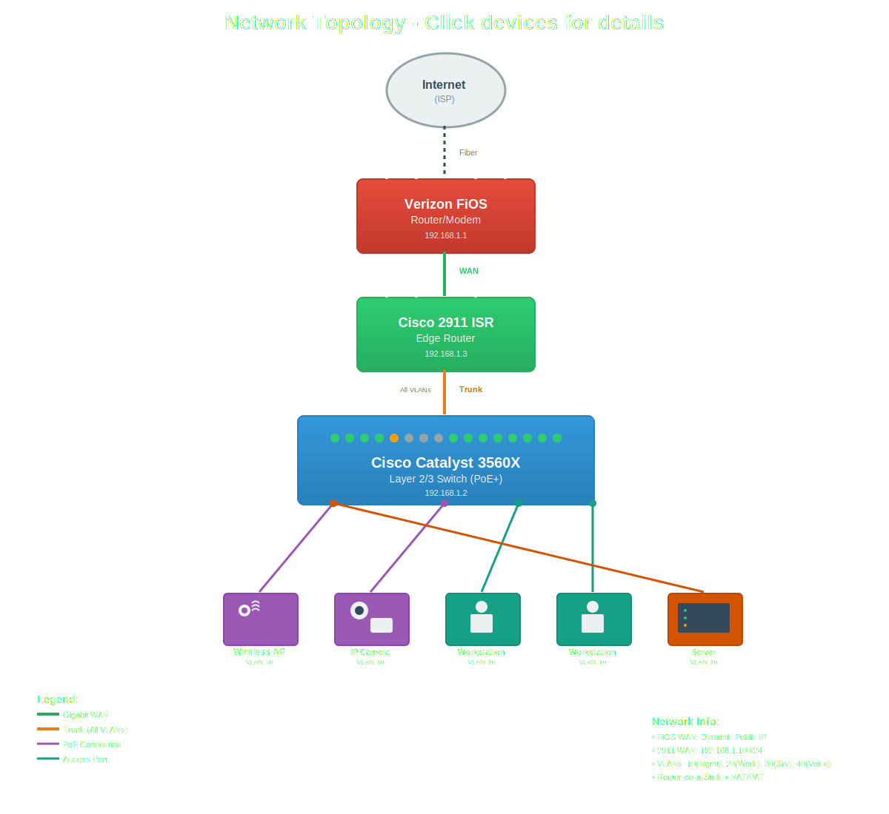

# Home Lab Network

Multi-VLAN enterprise network built on Cisco 2911 ISR + Catalyst 3560X Layer 3 switch.

## Hardware
- Cisco 2911 ISR (router)
- Cisco Catalyst 3560X (PoE+ Layer 3 switch)
- Raspberry Pi 5 (NAS/NVR)
- 12U rack cabinet + UPS

## What's Running
- VLANs for segmentation (IoT, workstation, management)
- Inter-VLAN routing via Router-on-a-Stick + Layer 3 SVIs
- ACLs blocking lateral movement between zones
- Pi-hole for DNS filtering
- NAS/NVR for centralized storage and config backups

## Topology

